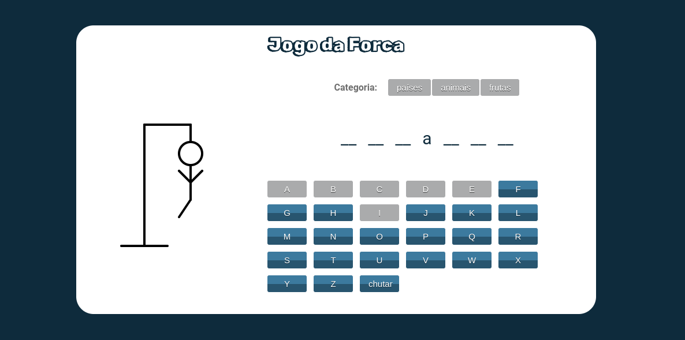
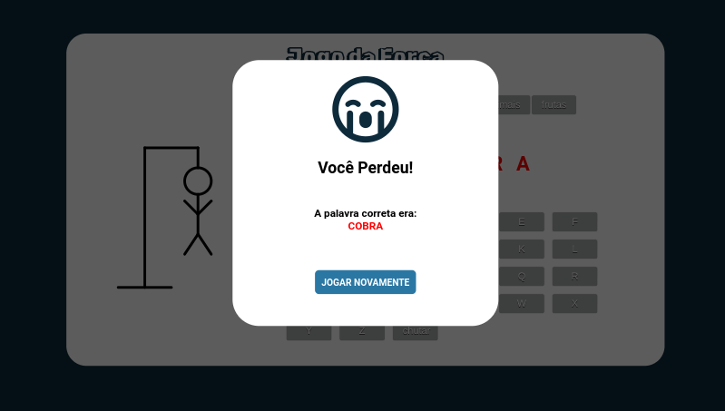

# Projeto Final do Módulo - Front-End Dinâmico (JS DOM)

## Desenvolver o clássico Jogo da Forca

O que foi proposto pelo professor:

- Permitir que o jogador escolha uma categoria (por exemplo, países, animais, filmes) e exiba a palavra oculta;
- Implementar a lógica do jogo, permitindo que o jogador insira letras até adivinhar a palavra ou ser enforcado.

### Grupo:
- Brenda Rayane
- Douglas Alves
- Leandro Bispo 

### Imagens do projeto:

    

    

